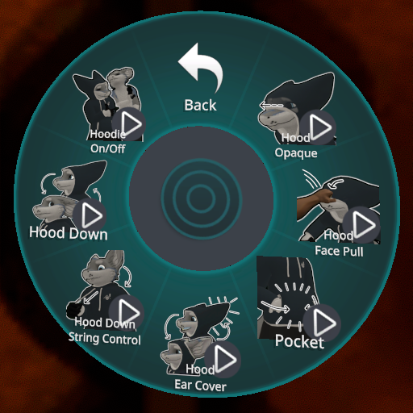
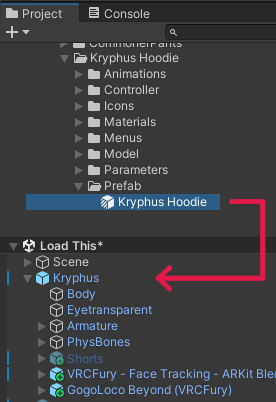
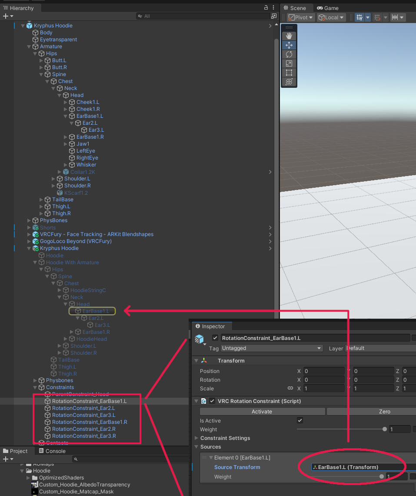
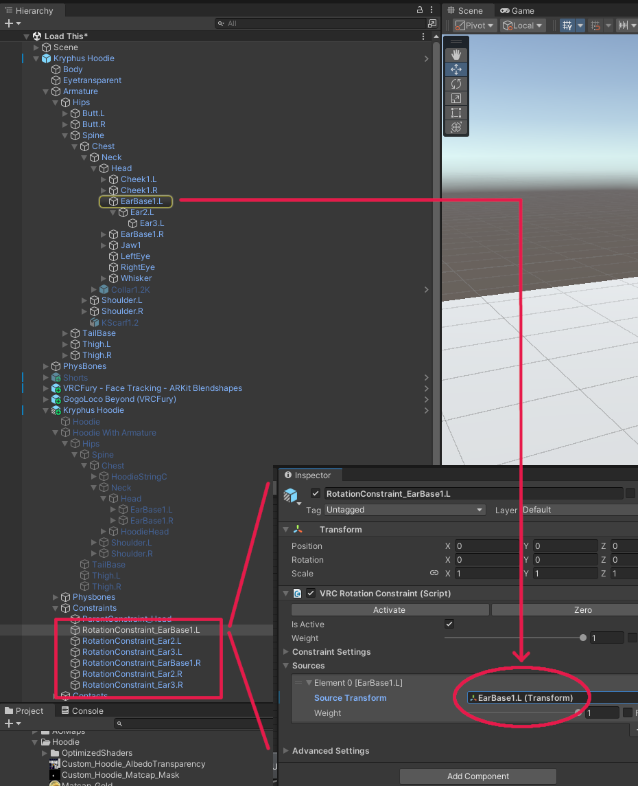
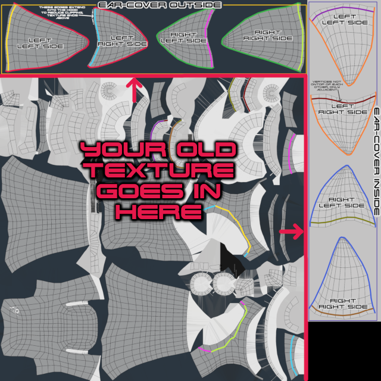

# Kryphus-Hoodie

An enhanced version (with small fixes) of the original Hoodie for the Kryphus (a VRC-Avatar) which tries to remain backwards-compatibility to the original Kryphus model and hoodie as much as possible.

If you run into any issues, have suggestions or bug-reports - don't hesitate to contact me! Much appreciated. <3

## Features

* All the features of the original hoodie
* Clipping of body parts and fur fixed
* Cozy, warm covers for your ears!
* Putting your hands into the pockets will make it buldge out
* People can pull the hood into your face, blocking your sight
* A toggle to make the hood invisible in first person

## Installation
### Prerequisites

* You need VRCFury 1.1163.0 or higher installed in your project for this hoodie to work: [vrcfury.com](https://vrcfury.com/)

### Adding The Hoodie To Your Kryphus

* Import the Kryphus_Hoodie.unitypackage into your project (by using "Import Package..." or drag and dropping the file from your explorer into your project-tab)
* Place the Prefab 'Kryphus Hoodie' from 'KryphusFolder/Clothing/FBX & Textures/Kryphus Hoodie/Prefab' onto the highest level of your Avatar-Hierarchy:

### Workaround For A Bug In VRC's Rotational Constraints

VRC SDK 3.7.2 up to the current version (3.7.5 at the writing of this document) has a bug that prevents additional VRC-Fury generated bones to be the source transformation for rotational constrainted target bones - or to put simply, your ears won't wiggle.
A current workaround is to use the Ear-Bones from the Kryphus itself as the source transform, what sadly makes the asset not self contained.

For all hoodie rotational constraints (RotationConstraint_EarBase1.L/R, RotationConstraint_Ear2.L/R, RotationConstraint_Ear3.L/R) you need to change the source transform to the corresponding one from the Kryphus Avatar itself - not the one from the hoodie armature.

How it is setup in the prefab:

What you need to change for the ears to wiggle:

And you're done - start play-mode to test if everything works!

## Using Your Own Pre-Existing Texture

The textures of the new hoodie are 2560x2560 (which Unity scales down/up according to your image import settings) - with your original/custom texture being in the left bottom 2048x2048 part of it. The ear covers are distributed along the upper and right border.
Check the included XCFs/PSDs - they have a layer which tells you where to put your old texture:

Enjoy!

## Terms Of Service

* This hoodie is almost entirely based on the Kryphus Hoodie from the original creator, Dale R. [(Link to his Gumroad)](https://dalearts.gumroad.com/). He kindly agreed to make this one public, even though the original version is liable to costs. So please, if you like this hoodie, consider buying the clothing additions for the Kryphus from him, or leave him a tip through the usual channels. Much appreciated!
* You can customize this hoodie however you like - including getting comissions done on it - but don't build public avatars with it (due to reasons above). Contact me in that case!
* Reuploading or selling anything in this repository - or any works based off from it - is prohibited. Feel free to contact me if you have questions - again, the original Hoodie is liable to cost and this one is based heavily on it.
* If you want to share this hoodie, please share it through this github-page, so people are able to read the Terms of Service.
* By downloading anything from this repository you agree to all of these terms, accepting them as legally binding.

